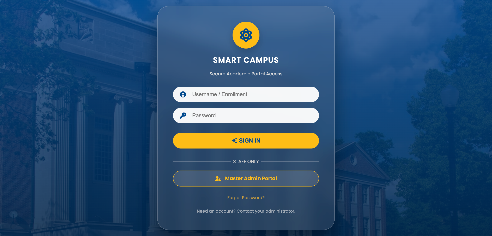
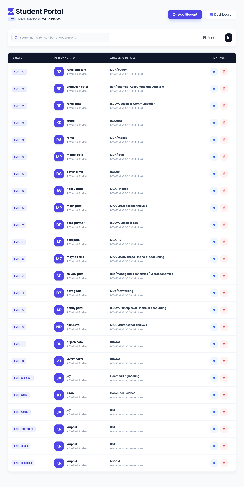
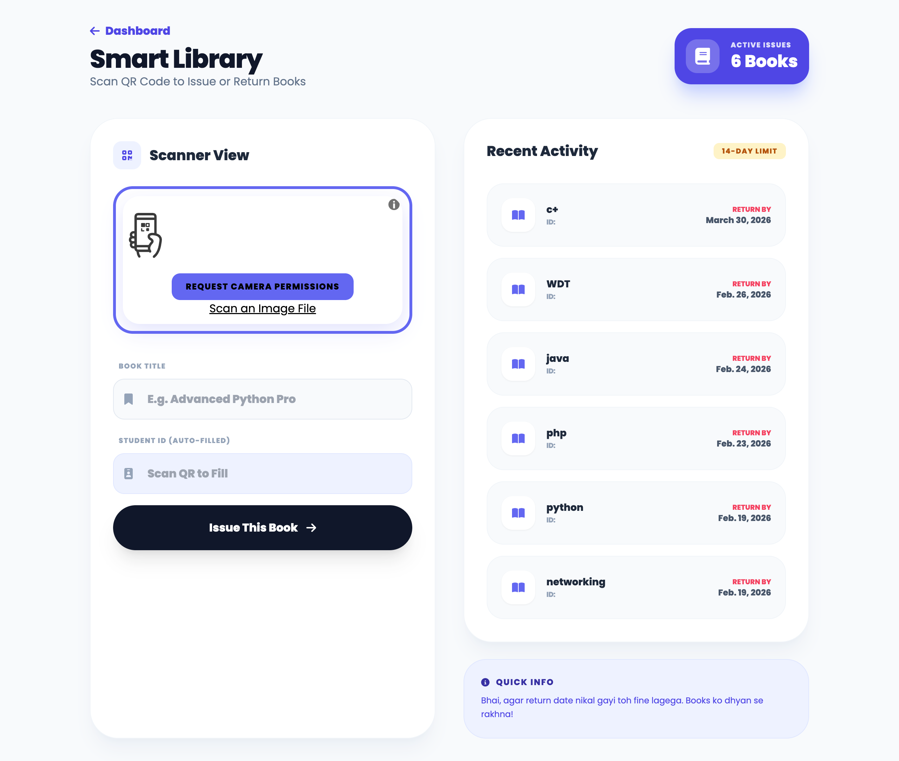

# Smart Campus - Python Django Project

A comprehensive campus management system built with Django, featuring student management, attendance tracking, QR code generation, event management, and more.

## Project Overview

Smart Campus is a full-featured web application designed to streamline campus operations including:
- Student and faculty management
- Attendance tracking with QR codes
- Course and subject management
- Event management
- Fee tracking
- Library and mess management
- Exam portal
- ID card generation

## Project Screenshots

### Home Page


### Login Page


### Students Management


### Library Scanner


## Prerequisites

- Python 3.8 or higher
- pip (Python package installer)

## Installation Steps

### 1. Clone the Repository
```bash
git clone https://github.com/brainybeamGit/Smart_Campus_Py.git
cd Smart_Campus_Py
```

### 2. Create Virtual Environment
```bash
python3 -m venv .venv
```

### 3. Activate Virtual Environment

**On macOS/Linux:**
```bash
source .venv/bin/activate
```

**On Windows:**
```bash
.venv\Scripts\activate
```

### 4. Install Dependencies
```bash
pip install -r requirements.txt
```

The project requires the following packages:
- Django>=4.2,<5.0
- qrcode
- Pillow

### 5. Run Migrations (if needed)
```bash
cd smartcampus
python manage.py migrate
```

### 6. Run the Development Server
```bash
python manage.py runserver
```

The application will be available at: **http://127.0.0.1:8000/**

## Project Structure

```
smart_campus/
├── .venv/                  # Virtual environment (auto-generated)
├── .gitignore             # Git ignore file
├── requirements.txt       # Python dependencies
├── README.md             # This file
├── 69.pdf                # Project documentation
├── 69.pptx               # Project presentation
└── smartcampus/          # Django project directory
    ├── manage.py         # Django management script
    ├── db.sqlite3        # SQLite database
    ├── media/            # Media files
    │   ├── events/       # Event images
    │   ├── qr_codes/     # Generated QR codes
    │   └── student_photos/ # Student profile photos
    ├── campus/           # Main app
    │   ├── models.py     # Database models
    │   ├── views.py      # View functions
    │   ├── urls.py       # URL patterns
    │   ├── templates/    # HTML templates
    │   ├── migrations/   # Database migrations
    │   └── admin.py      # Admin configuration
    └── smartcampus/      # Project settings
        ├── settings.py   # Django settings
        ├── urls.py       # Main URL configuration
        └── wsgi.py       # WSGI configuration
```

## Features

### 1. User Management
- Admin, Faculty, and Student roles
- Secure authentication system
- Profile management

### 2. Academic Management
- Course catalog
- Subject management
- Student enrollment
- Faculty assignment

### 3. Attendance System
- QR code-based attendance
- Manual attendance marking
- Attendance reports
- Date-wise tracking

### 4. Event Management
- Event creation and management
- Event registration
- Event details display

### 5. Fee Management
- Fee tracking
- Receipt generation
- Fee dashboard

### 6. Additional Features
- Library management with QR scanning
- Mess management
- Exam portal
- Student ID card generation
- Result management

## Database

The project uses SQLite by default (`db.sqlite3`). The database includes tables for:
- Users (Admin, Faculty, Students)
- Courses and Subjects
- Attendance records
- Events and registrations
- Fee records
- Results

## Media Files

- **Events**: Campus event images and banners
- **QR Codes**: Auto-generated QR codes for students
- **Student Photos**: Profile pictures uploaded by students

## Development

### Running Tests
```bash
python manage.py test
```

### Creating Superuser
```bash
python manage.py createsuperuser
```

### Collecting Static Files
```bash
python manage.py collectstatic
```

## Deployment

For production deployment:
1. Set `DEBUG = False` in `smartcampus/settings.py`
2. Configure a production database (PostgreSQL recommended)
3. Set up static file serving
4. Configure allowed hosts
5. Use a production WSGI server (Gunicorn recommended)

## Contributing

Contributions are welcome! Please feel free to submit a Pull Request.

## License

This project is licensed under the MIT License.

## Contact

For questions or support, please open an issue on GitHub.

---

**Repository**: https://github.com/brainybeamGit/Smart_Campus_Py.git
